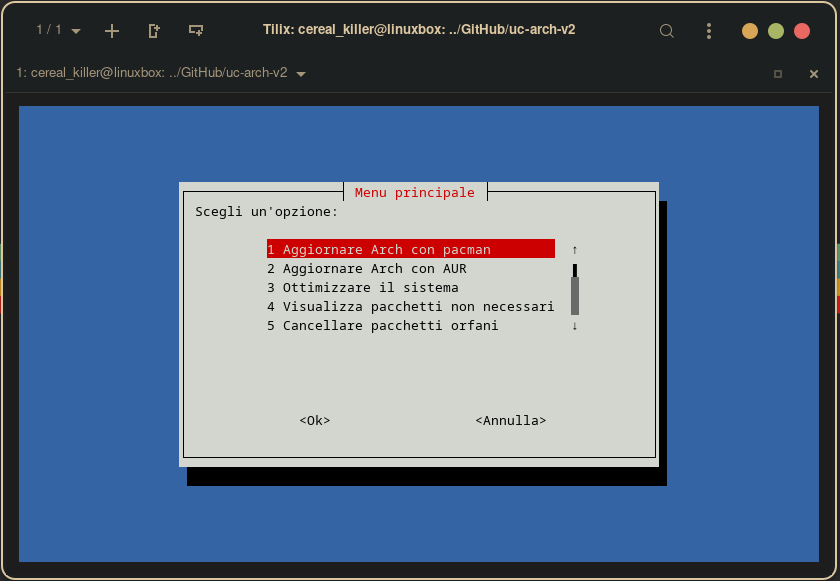

# uc-arch-v2

##### This bash script is a simple program that offers some functionalities for managing packages on a Linux arch-based system using the "pacman" package manager and the "yay" utility for AUR packages. 

##### Includes a function called "check_yay" that checks if the "yay" utility is installed on the system. If  is not, the user is prompted to install it and executes the `sudo pacman -S yay`. Also provides functions for updating pacman packages and AUR packages. 

##### There are also functions for cleaning orphaned packages and the pacman cache. The "clean_orphans" function uses the `pacman -Qdtq` command to obtain the orphaned packages and then executes `sudo pacman -Rns` to remove them. 

##### The "clean_cache" function checks the cache size, if the size is not zero, it clean the cache. User can select an option by entering the corresponding number. In case of invalid input, an error message is displayed.




## Start without local installation:

before running script make executable with:

```
chmod +x uc-arch-v2.sh
```

then:

```
./uc-arch-v2.sh
```

## Make a local installation:

- clone  repo
```
git clone https://github.com/giuseppetnt/uc-arch-v2.git
```

- enter  directory
```
cd uc-arch-v2
```

- compile and install
```
makepkg -si
```

- start with
```
uc-arch-v2.sh
```


### Sponsor

### Main sponsor


www.blenderchannel.it